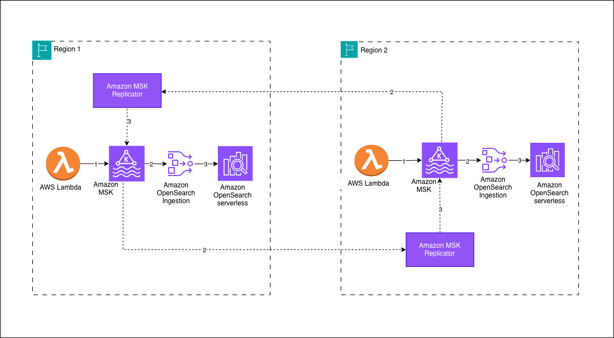

# Architecture Diagram and Documentation

## Overview

This document provides a detailed breakdown of the cross-region resilience architecture for Amazon OpenSearch Service using Amazon MSK and OpenSearch Ingestion.

## High-Level Architecture



The architecture diagram above illustrates the bidirectional active-active replication between two AWS regions using MSK Replicator and OpenSearch Ingestion pipelines.

## Component Details

### 1. Amazon MSK (Managed Streaming for Apache Kafka)

#### Primary Region MSK Cluster
- **Broker Configuration**: 3 brokers across 3 Availability Zones
- **Instance Type**: kafka.m5.large (2 vCPU, 8 GB RAM)
- **Storage**: 100 GB EBS per broker (expandable)
- **Network**: Deployed in private subnets with VPC isolation
- **Security**: IAM authentication, TLS encryption in transit, AWS KMS encryption at rest

#### Secondary Region MSK Cluster
- **Configuration**: Mirror of primary cluster
- **Purpose**: Receives replicated data via MSK Replicator (MirrorMaker 2.0)
- **Independence**: Can function independently if primary region fails

#### Topic Configuration
```
Topic Name: opensearch-data
Partitions: 6
Replication Factor: 3
Min In-Sync Replicas: 2
Retention: 24 hours (86400000 ms)
Compression: Snappy
```

### 2. MSK Replicator (Cross-Region Replication)

- **Technology**: Apache Kafka MirrorMaker 2.0
- **Direction**: Primary Region → Secondary Region
- **Configuration**:
  - Replication lag target: < 60 seconds
  - Topics to replicate: opensearch-data
  - Consumer group replication: Enabled
  - Offset sync: Enabled

### 3. OpenSearch Ingestion (OSI) Pipelines

#### Primary Region Pipeline
- **Compute**: Auto-scaling between 1-4 OCUs
- **Source**: Kafka (local MSK cluster)
- **Processor**:
  - Date transformation
  - JSON parsing
  - Field mapping and enrichment
- **Sink**: Local OpenSearch Serverless collection
- **Dead Letter Queue**: S3 bucket for failed documents

#### Secondary Region Pipeline
- **Configuration**: Identical to primary
- **Independence**: Consumes from local MSK cluster
- **Benefit**: No cross-region latency for data ingestion

### 4. OpenSearch Serverless Collections

#### Primary Region Collection
- **Name**: opensearch-primary
- **Type**: Time-series
- **Indexes**: application-logs-YYYY.MM.DD (daily rotation)
- **Access**: IAM-based data access policy
- **Encryption**: AWS-managed keys

#### Secondary Region Collection
- **Name**: opensearch-secondary
- **Configuration**: Identical index mappings as primary
- **Purpose**: Serve queries in secondary region or during primary region failure

## Data Flow Sequences

### Normal Operations

1. **Data Production**
   ```
   Application → Kafka Producer → MSK Primary (us-east-1)
   ```

2. **Cross-Region Replication**
   ```
   MSK Primary (us-east-1) → MSK Replicator → MSK Secondary (us-west-2)
   ```

3. **Primary Region Ingestion**
   ```
   MSK Primary → OSI Pipeline Primary → OpenSearch Serverless Primary
   ```

4. **Secondary Region Ingestion**
   ```
   MSK Secondary → OSI Pipeline Secondary → OpenSearch Serverless Secondary
   ```

5. **Query Execution**
   ```
   Application → OpenSearch Serverless (Primary or Secondary)
   ```

### Failure Scenario: Primary Region Unavailable

1. **Detection**
   ```
   Health Check Fails → Route53 Health Check → DNS Failover
   ```

2. **Data Production Continues**
   ```
   Note: No new data can be produced to MSK Primary
   Secondary region continues processing replicated data
   ```

3. **Query Routing**
   ```
   Application → Route53 → OpenSearch Serverless Secondary
   ```

4. **Recovery**
   ```
   Primary Region Restored → MSK catches up → OSI processes backlog → Normal operations resume
   ```

## Network Architecture

### VPC Configuration

#### Primary Region (us-east-1)
```
VPC CIDR: 10.0.0.0/16
Private Subnets:
  - 10.0.1.0/24 (us-east-1a) - MSK Broker 1
  - 10.0.2.0/24 (us-east-1b) - MSK Broker 2
  - 10.0.3.0/24 (us-east-1c) - MSK Broker 3
```

#### Secondary Region (us-west-2)
```
VPC CIDR: 10.1.0.0/16
Private Subnets:
  - 10.1.1.0/24 (us-west-2a) - MSK Broker 1
  - 10.1.2.0/24 (us-west-2b) - MSK Broker 2
  - 10.1.3.0/24 (us-west-2c) - MSK Broker 3
```

### Security Groups

#### MSK Security Group
```
Inbound:
  - Port 9098 (IAM auth): From OSI Security Group
  - Port 9098 (IAM auth): From Application Security Group
  - Port 2181 (ZooKeeper): Internal cluster communication

Outbound:
  - All traffic to 0.0.0.0/0 (for replication)
```

#### OSI Security Group
```
Inbound:
  - None (managed service)

Outbound:
  - Port 9098: To MSK Security Group
  - Port 443: To OpenSearch Serverless endpoints
```

## Security Architecture

### Authentication Flow

```
┌──────────────┐
│ Application  │
└──────┬───────┘
       │ (1) Assume IAM Role
       ▼
┌──────────────────┐
│  AWS STS         │
└──────┬───────────┘
       │ (2) Temporary Credentials
       ▼
┌──────────────────┐       (3) IAM Auth Request
│  MSK Cluster     │◄────────────────────────────
└──────┬───────────┘
       │ (4) Data Stream
       ▼
┌──────────────────┐       (5) IAM Auth Request
│  OSI Pipeline    │◄────────────────────────────
└──────┬───────────┘
       │ (6) Transformed Data
       ▼
┌──────────────────┐       (7) IAM Auth Request
│  OpenSearch      │◄────────────────────────────
│  Serverless      │
└──────────────────┘
```

### IAM Policies

#### Producer Policy
```json
{
  "Version": "2012-10-17",
  "Statement": [
    {
      "Effect": "Allow",
      "Action": [
        "kafka-cluster:Connect",
        "kafka-cluster:WriteData"
      ],
      "Resource": [
        "arn:aws:kafka:us-east-1:*:cluster/opensearch-msk-primary/*",
        "arn:aws:kafka:us-east-1:*:topic/opensearch-msk-primary/*/opensearch-data"
      ]
    }
  ]
}
```

#### OSI Pipeline Policy
```json
{
  "Version": "2012-10-17",
  "Statement": [
    {
      "Effect": "Allow",
      "Action": [
        "kafka-cluster:Connect",
        "kafka-cluster:ReadData",
        "kafka-cluster:DescribeTopic"
      ],
      "Resource": "arn:aws:kafka:*:*:cluster/opensearch-msk-*/*"
    },
    {
      "Effect": "Allow",
      "Action": [
        "aoss:APIAccessAll"
      ],
      "Resource": "arn:aws:aoss:*:*:collection/*"
    }
  ]
}
```

## Monitoring and Observability

### CloudWatch Metrics

#### MSK Metrics
- `BytesInPerSec`: Data ingestion rate
- `BytesOutPerSec`: Data consumption rate
- `ReplicationLatency`: Cross-region replication lag
- `UnderReplicatedPartitions`: Partition health
- `OfflinePartitionsCount`: Partition availability

#### OSI Metrics
- `DocumentsIngested`: Successful document processing
- `DocumentsFailed`: Failed document processing
- `PipelineLatency`: End-to-end processing time
- `OCUUtilization`: Compute resource usage

#### OpenSearch Serverless Metrics
- `IndexingRate`: Documents indexed per second
- `IndexingLatency`: Time to index documents
- `SearchRate`: Queries per second
- `SearchLatency`: Query response time

### CloudWatch Alarms

1. **Critical Alarms**
   - MSK cluster down
   - High replication lag (> 2 minutes)
   - OSI pipeline failure rate > 5%
   - OpenSearch collection unavailable

2. **Warning Alarms**
   - MSK replication lag > 60 seconds
   - OSI pipeline latency > 30 seconds
   - OpenSearch indexing latency > 10 seconds

## Capacity Planning

### MSK Cluster Sizing

| Data Volume | Broker Count | Instance Type | Storage per Broker |
|-------------|--------------|---------------|--------------------|
| < 1 TB/day  | 3            | kafka.m5.large | 100 GB            |
| 1-5 TB/day  | 3            | kafka.m5.xlarge | 500 GB           |
| 5-10 TB/day | 6            | kafka.m5.xlarge | 1 TB             |
| > 10 TB/day | 9            | kafka.m5.2xlarge | 2 TB            |

### OSI Pipeline Sizing

| Throughput    | Min OCUs | Max OCUs | Batch Size |
|---------------|----------|----------|------------|
| < 10 MB/s     | 1        | 2        | 100        |
| 10-50 MB/s    | 2        | 4        | 500        |
| 50-100 MB/s   | 4        | 8        | 1000       |
| > 100 MB/s    | 8        | 16       | 2000       |

### OpenSearch Serverless Sizing

| Index Size    | Query Load  | Estimated OCUs (Indexing) | Estimated OCUs (Search) |
|---------------|-------------|---------------------------|-------------------------|
| < 100 GB      | Light       | 2                         | 2                       |
| 100-500 GB    | Medium      | 4                         | 4                       |
| 500 GB-1 TB   | High        | 8                         | 6                       |
| > 1 TB        | Very High   | 12                        | 10                      |

## Disaster Recovery

### Recovery Time Objective (RTO)

- **DNS Failover**: 1-5 minutes
- **Application Reconnection**: < 1 minute
- **Total RTO**: < 10 minutes

### Recovery Point Objective (RPO)

- **Normal Conditions**: < 60 seconds (replication lag)
- **High Load**: < 5 minutes
- **Data Loss Risk**: Minimal (MSK durability + replication)

### Failover Process

1. **Automatic Detection**
   - CloudWatch alarms trigger
   - Route53 health checks fail
   - DNS automatically updates

2. **Application Response**
   - Producers switch to secondary region (manual or automated)
   - Query clients automatically routed to secondary
   - No data loss for data already replicated

3. **Failback Process**
   - Primary region recovers
   - MSK replication catches up
   - OSI pipeline processes backlog
   - Automatic return to active-active state

## Cost Considerations

### Monthly Cost Breakdown (Sample)

| Component | Configuration | Monthly Cost |
|-----------|--------------|--------------|
| MSK Primary | 3 × kafka.m5.large | $907 |
| MSK Secondary | 3 × kafka.m5.large | $907 |
| MSK Storage | 1 TB total | $100 |
| MSK Cross-Region Transfer | 3 TB | $60 |
| OSI Primary | 2 OCU average | $350 |
| OSI Secondary | 2 OCU average | $350 |
| OpenSearch Primary | 4 OCU total | $700 |
| OpenSearch Secondary | 4 OCU total | $700 |
| OpenSearch Storage | 500 GB total | $12 |
| **TOTAL** | | **$4,072** |

## Best Practices

1. **MSK Configuration**
   - Use at least 3 brokers across 3 AZs
   - Enable compression (snappy recommended)
   - Set appropriate retention periods
   - Monitor disk usage and scale proactively

2. **OSI Pipelines**
   - Use consistent configurations across regions
   - Implement dead-letter queues
   - Monitor consumer lag
   - Test transformation logic thoroughly

3. **OpenSearch Serverless**
   - Use time-based index rotation
   - Implement index lifecycle policies
   - Optimize query patterns
   - Monitor OCU utilization

4. **Operational**
   - Regular DR testing
   - Automated monitoring and alerting
   - Document runbooks
   - Implement chaos engineering practices

## Conclusion

This architecture provides enterprise-grade cross-region resilience for OpenSearch workloads with minimal operational overhead. The active-active model ensures continuous availability and eliminates manual failback procedures, making it suitable for mission-critical applications requiring high availability and disaster recovery capabilities.
